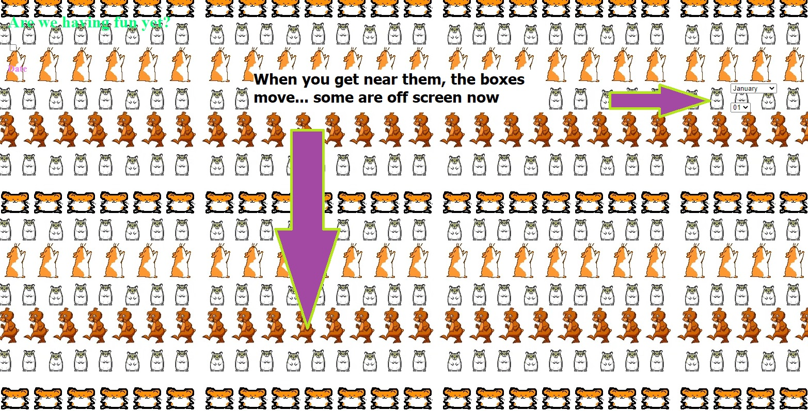
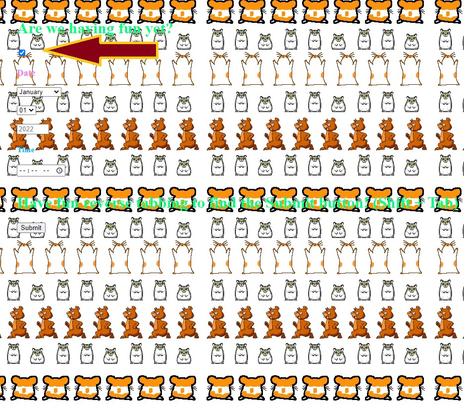

## Click Here - an exercise in futility.

Throwback to the easy days, when you had dizzying hamsters singing songs to you on a website that took all of your computer resources and 15 minutes to load. 

If you try to select the date/time/submit - they move.

You may have noticed that this is an incredibly wide image... that's because the boxes like to move all over the page. Some go to the right, some go to the bottom. It's a scavenger hunt really. 

Your best bet, if you actually want to enter a day/time, is to click here (and then tab to the boxes to fill them out) BUTTTTT

### I must warn you
The tabs are unordered. Once you've filled out the boxes, you'll have to reverse tab until it randomly gets to submit. I hope this brings as much joy as possible to all of those who view this American splendor.

I do my best design work in paint. Thanks for the arrows. MS Paint always out here doing us solids. 